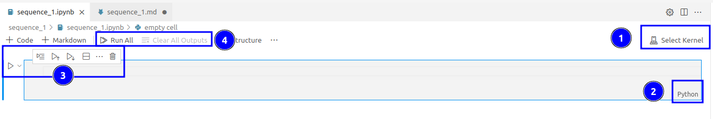
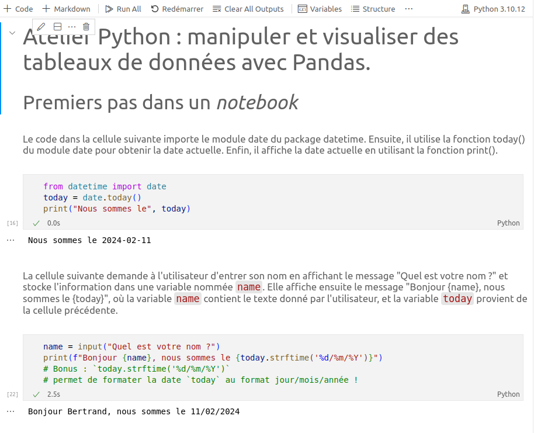
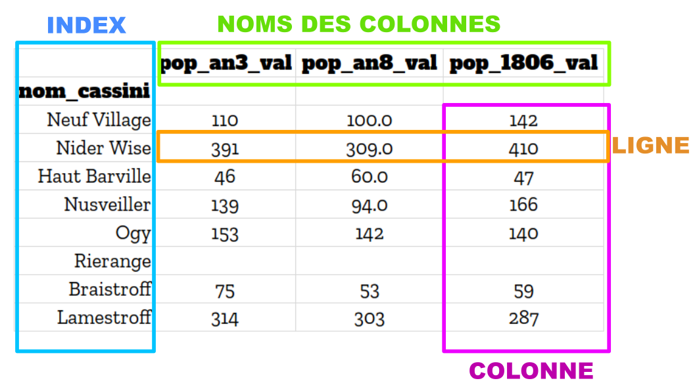
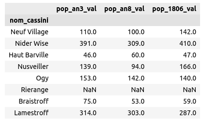
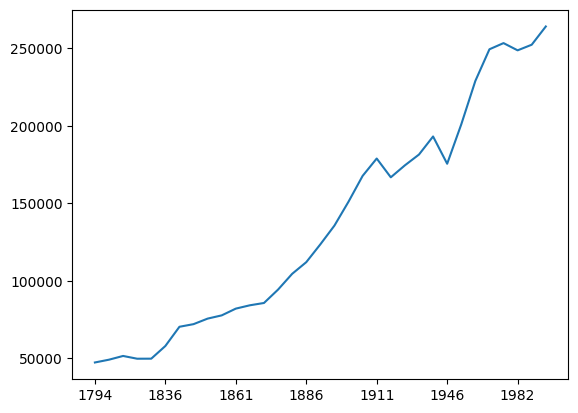
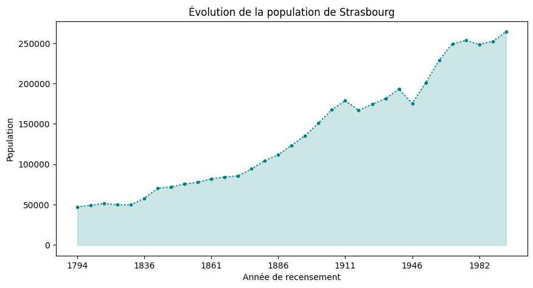
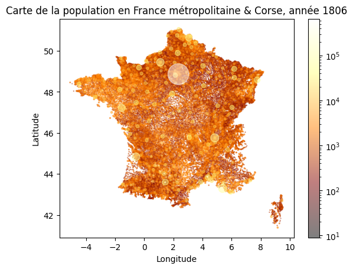

# Manipuler et visualiser des tableaux de données avec Pandas dans un Notebook Jupyter


## 1. Jupyter et ses notebooks

[Jupyter](https://jupyter.org/) est un projet *open source* dont l'objectif est de développer des logiciels libres d'**informatique interactive** multi-langages de programmation[^1], dont l'exemple le plus connu est le système de cahiers électroniques appelés **Notebooks**.

Un *notebook* Jupyter est un document manipulable interactivement dans un navigateur Web, qui peut rassembler du code exécutable, avec du texte et des images[^2]. Un *notebook* est un outil incroyablement puissant pour mettre au point, décrire et partager des analyses de données. C'est aujourd'hui un incontournable de tout travail de *data science*. En sciences-humaines, ils sont extrêmement utiles pour échanger sur des données et leurs analyses avec les chercheurs.

### Installation & lancement
Pour pouvoir utiliser des *notebooks*, il faut installer la bibliothèque Python [`jupyter`](https://pypi.org/project/jupyter/) publiée par le projet.

Ce paquet installe l'environnement web interactif de Jupyter, c'est à dire une application web qui permet de lire, d'écrire et d'interagir avec un *notebook*.

Avec pip :
```shell
pip install jupyter
```

> ⚠️ Attention à avoir activé l'environnement virtuel Python avant d'installer jupyter, afin de ne pas "polluer" l'installation système de Python avec des bibliothèques utiles uniquement pour l'atelier.


Créer et manipuler un *notebook* se fait donc depuis l'application Jupyter.

**Si vous utilisez Visual Studio Code**, l'extension Jupyter permet d'intégrer l'application directement dans l'interface de Visual Studio. Installez-la depuis le *marketplace* (`ctrl+shift+x`).

**Si vous n'utilisez pas Visual Studio Code**, vous devrez utiliser directement l'application web Jupyter, que vous pouvez démarrer depuis un terminal :
```shell
jupyter notebook
```

### Bases du notebook
> ℹ️ Dans la suite on considère que VSCode est utilisé. Tout est cependant similaire avec l'application Jupyter, seuls les menus diffèrent.

Un *notebook* est simplement un fichier JSON avec l'extension `.ipynb`, que l'environnement Jupyter est capable d’interpréter.

 ✏️ **Q1. Création**

 Créez un nouveau *notebook*, soit depuis le menu `fichier->nouveau fichier` (VSCode devrait alors vous proposer de créer un *Jupyter Notebook*), soit avec la palette de commandes (`ctrl+shift+p`) en cherchant *Create: New Jupyter Notebook*.
Sauvegardez immédiatement ce *notebook* vide sous `session_2/sequence_1/sequence_1.ipynb`, ce sera votre cahier de travail pour cette séquence !

Le *notebook* ouvert, contient par défaut une première **cellule** de code Python, vide : 


Sont surlignés quelques-un des contrôles les plus importants d'un *notebook*:
1. un noyau Python doit être choisi pour que Jupyter/VSCode puisse exécuter les cellules de code. **Sélectionnez ici l'environnement Python virtuel créé dans la session 1 de l'atelier**.
2. le type de contenu de la cellule, qui peut être changé à tout moment. Par défaut il est auto-détecté et on peut le laisser tel quel.
3. et 4. les contrôles principaux d'exécution des cellules du *notebook*. Passer le curseur sur un bouton permet d'avoir une description de son action.


> ⚠️ Sauf mention contraire, dans la suite de l'atelier vous devrez créer une nouvelle cellule pour **chaque nouvelle question** afin de conserver un notebook clair et facile à suivre.


 ✏️ **Q2. Premier essai : sortie (très) simple.**

Ajoutez dans cette première cellule un code Python qui affiche avec `print()` la date du jour.
Exécutez ensuite le code de la cellule, en cliquant sur le bouton ▶ à sa gauche, ou bien avec le raccourci `ctrl+entrée`.
Le résultat de la cellule devrait s'afficher en dessous de celle-ci.

La date peut-être récupérée avec :
```python
from datetime import date
today = date.today()
```

> ℹ️ Jupyter affiche par défaut la valeur de la dernière expression interprétée. Par exemple, la cellule suivante affichera la date (non formatée) même s'il n'y a pas d'appel à `print()`, car la dernière expression évaluée est la lecture de la variable `today`.
> ```python
> from datetime import date
> today = date.today()
> today
> ```
> Ou encore plus simplement, sans stocker la date dans la variable `today` :
> ```python
> from datetime import date
> date.today()
> ```

✏️ **Q3. Deuxième essai : lecture interactive d'une information**
L'interactivité des *notebooks* est précieuses pour tester son code en direct, mais également pour créer de véritables "cahiers interactifs", qui peuvent par exemple lire une entrée utilisateur.

Ajoutez une nouvelle cellule de code sous la première, soit avec le bouton `+code` en haut à gauche du *notebook*, soit en passant le curseur sous la première cellule pour faire apparaître le même bouton.

Insérez dans cette nouvelle cellule un code qui demande son nom à l'utilisateur puis affiche le message `"Bonjour {name}"`.

> ℹ️ la fonction native Python `input("prompt")` permet de lire une chaîne de caractère sur l'entrée standard (usuellement la console) tout en affichant le message "prompt". 
> Par exemple :
> ```python
> var = input("Ceci s'affichera au moment de demande une saisie")
> print(var)
>```
> Dans un *notebook*, l'entrée standard n'est plus la console mais l'interface de Jupyter. Avec `input()`, le *notebook* va automatiquement afficher un petit formulaire de saisie !


✏️ **Q4. Portée du contenu des cellules**
Les cellules peuvent être exécutées séparément, donnant l'impression qu'il s'agit de petits programmes indépendants. **Ce n'est pas le cas**. Un *notebook* a un unique contexte d'exécution : les variables, fonctions et classes déclarées dans une cellule sont visibles par les autres cellules.

Pour s'en convaincre, modifiez la seconde cellule pour qu'elle affiche le message `"Bonjour {name}, nous sommes le {today}"`, où `today` est la valeur du jour stockée dans la première cellule.


> **📝 À retenir.**
Exécuter un *notebook*, c'est d'avantage "dérouler" un script Python pas à pas, avec une interaction entre chaque étape (ex. afficher un résultat intermédiaire), qu'exécuter des petits programmes indépendants. Cela semble trivial mais peut aisément jouer des tours lorsqu'on crée un *notebook* complexe !

✏️ **Q5. Programmation lettrée**

Ce qui donne en réalité toute leur puissance aux *notebooks*, c'est leur capacité à enrichir et documenter et structurer le code avec du "vrai" texte riche, en Markdown.

Ajoutez une cellule Markdown au début du *notebook*, avec le texte suivant :
```markdown
# Atelier Python : manipuler et visualiser des tableaux de données avec Pandas.

## Premiers pas dans un *notebook*
```

Ajoutez une cellule Markdown avant chacune des cellules de code, et décrivez dedans ce que fait le code qui suit.

> ℹ️ Il faut exécuter les cellules Markdown pour que Jupyter affiche le rendu.

Le *notebook* final pourra ressembler à ceci :


----------
#### Notes
[^1]: Le nom Jupyter vient des trois langages de programmation pris en charge par le projet : **Ju**lia, **Py**thon et **R**. 

[^2]: Les *notebooks* Jupyter sont un exemple de programmation lettrée. 
> "Le principe de la programmation lettrée est le suivant: plutôt que d’organiser le code en fonction des besoins d’exécution de l’ordinateur, la programmation lettrée traite le code comme un texte qui doit être compréhensible pour ses lecteurs et qui exprime clairement la pensée du programmeur ou de la programmeuse."
> https://programminghistorian.org/fr/lecons/introduction-aux-carnets-jupyter-notebooks#programmation-lettr%C3%A9e


## 2. Manipuler des tableaux de données avec Pandas

Pandas est **LA** bibliothèque logicielle Python de manipulation et de traitement de données tabulaire. Avec Jupyter, elle fait partie des outils essentiels du *data analyst*, et plus largement de toute personne manipulant des données en Python. Ses atouts principaux : une masse de fonctionnalités et une capacité à traiter de très grandes tables rapidement.
Si elle est totalement indépendante de l'écosystème Jupyter (on aurait pu construire la CLI de la session 1 avec Pandas), on la retrouve **très** souvent utilisée dans des *notebooks*.

La documentation de Pandas est disponible à https://pandas.pydata.org/docs/

### Installation
Comme pour tout paquet Python, on peut utiliser pip.
```shell
pip install pandas
```

Ensuite, on pourra importer Pandas avec
```Python
import pandas as pd
# Note : la mention 'as pd', optionnelle, sert à déclarer un alias plus court. C'est un simple confort, mais on trouve le plus souvent pandas importée de cette manière. Cela permet d'écrire par exemple :
# pd.DataFrame(...)
# au lieu de 
# pandas.DataFrame(...)
```

## Expérimentations

Extrêmement populaire, Pandas n'en est pas moins assez déroutante les débutants, car la manière d'accéder et manipuler des données est très différente de celle classique de Python.

Pandas organise toutes les données en **tableaux** (*array*).
En voici par exemple un à deux dimensions qui donne la population 8 villages de Moselle lors de trois recensements à l'époque révolutionnaire puis impériale, en l'an III (1794-1795), en l'an VIII (1799-1800) et en 1806.


Fig. 2 : population de 8 villages mosellans entre l'an III et 1806.

Cette figure montre également certaines notions essentielles de l'interface de Pandas :
- **[bleu]** d'abord, chaque ligne est **indexée** par une valeur unique dans un séquence nommée **index**. Ici, c'est le nom du village dans la carte de Cassini du XVIIIe siècle qui sert d'index (l'index est nommé "nom_cassini"). Lorsque l'index est fait de chaînes de caractères comme ici, on parle aussi d'**étiquettes** (*labels*);
- **[vert]** il y a ensuite un ensemble de colonnes nommées, ici "pop_an3_val", "pop_an8_val" et "pop_1806_val".;
- **[orange]** une ligne contient les cellules pour une valeur d'index donnée;
- **[rose]**  une colonne contient les cellules pour un nom de colonne donné.


✏️ **Q6. Section Pandas**.

Créez une nouvelle cellule Markdown dans votre *notebook* avec une section de niveau 2 (## ...) nommée "Expérimentations avec Pandas".

✏️ **Q7. Créer une *DataFrame***.

Les tableaux à 2 dimensions sont appelés ***DataFrame***. On peut créer la *DataFrame* ci-dessus par exemple à partir d'un dictionnaire Python : 
```python
data = {
    # 'colonne': [éléments, de, la, colonne]
    'nom_cassini': ['Neuf Village', 'Nider Wise', 'Haut Barville', 'Nusveiller', 'Ogy', 'Rierange', 'Braistroff', 'Lamestroff'],
    'pop_an3_val': [110, 391, 46, 139, 153, None, 75, 314],
    'pop_an8_val': [100, 309, 60, 94, 142, None, 53, 303],
    'pop_1806_val': [142, 410, 47, 166, 140, None, 59, 287]
}
populations = pd.DataFrame(data)
```

Dans une nouvelle cellule Python, placez le code ci-dessus et affichez `populations`. N'utilisez pas `print`, mais évaluez simplement la variable comme dernière instruction de la cellule, afin de profiter du rendu HTML de Pandas.

Notez les numéros à gauche de chaque ligne : c'est un index auto-généré. En effet nous n'avons pas dit à Pandas d'utiliser les noms des villages comme index !

Pour que la colonne `nom_cassini` devienne l'index du tableau, utilisez la méthode `pupulations.set_index()` à l'aide de sa documentation : https://pandas.pydata.org/docs/reference/api/pandas.DataFrame.set_index.html

> ⚠️ Soyez particulièrement attentifs au paramètre `inplace`, que vous retrouverez très régulièrement avec Pandas. 

Une fois l'index défini, le tableau affiché doit ressembler à ceci :


### Sélections
La première chose que l'on peut faire avec un tableau, c'est sélectionner ses éléments. Pandas propose trois modes essentiels de sélection :
1. par colonne : `populations["pop_an3_val"]` ou `populations.pop_an3_val`.
2. par index (=par ligne), à l'aide de la méthode `DataFrame.iloc()` **si et seulement si** l'index est fait de nombres entiers;
3. par étiquette (= par index en texte), à l'aide de la méthode `DataFrame.loc()`.

✏️ **Q8. Sélections**.

Créez une nouvelle cellule Python, et affichez les selections suivantes:
1. la colonne `pop_1806_val`;
2. le sous-tableau contenant les colonnes `pop_an3_val` et `pop_an8_val`. Utilisez pour cela la syntaxe `populations[["colonne1", "colonne2"]]`;
3. la ligne ayant l'étiquette "Neuf Village";
4. les lignes du tableau de "Neuf Village" à "Ogy". Cela se fait de la même manière que pour sélectionner une tranches dans une liste ([*slices*](https://www.geeksforgeeks.org/python-list-slicing/)), avec l'opérateur `liste[DEBUT:FIN]`.

> ℹ️ Pour afficher un résultat avant la dernière ligne de la cellule, utilisez `print()`.


> ⚠️ Observez ce qui est affiché lorsque vous sélectionnez une unique ligne ou une unique colonne. Ce qui est renvoyé n'est plus une **DataFrame** mais une **Series**, c'est à dire une liste nommée dont chaque élément possède une étiquette. En fait, à l'intérieur de Pandas, une **DataFrame** est tout simplement une collection de **Series**.

### Un aperçu succinct de la "magie" Pandas
Pandas propose une collection impressionnante de fonctionnalités qu'il est impossible de couvrir dans cette session.

Testons-en tout de même quatre, qui montrent un aperçu rapide de la puissance de Pandas pour travailler facilement avec des tableaux de données pouvant être massifs.

✏️ **Q9. Sélection conditionnelle : masques booléens**.

En plus des selections simples, Pandas est capable de sélectionner des parties d'un tableau sous conditions, avec une syntaxe relativement simple.
En voici un exemple qui sélectionne les villages ayant plus de 100 habitants à l'an III :
```python
populations[populations['pop_an3_val'] > 100]
# Résultat =>
#                pop_an3_val  pop_an8_val  pop_1806_val
# nom_cassini                                         
# Neuf Village        110.0        100.0         142.0
# Nider Wise          391.0        309.0         410.0
# Nusveiller          139.0         94.0         166.0
# Ogy                 153.0        142.0         140.0
# Lamestroff          314.0        303.0         287.0
```
En regardant de plus près, on voit que la syntaxe est `populations[CONDITION]`, où CONDITION est une comparaison directement effectuée sur la colonne `'pop_an3_val'` du tableau. 

Pour mieux comprendre, placez-vous dans une nouvelle cellule Python, copiez uniquement la condition `populations['pop_an3_val'] > 100` et affichez en le résultat.

Observez les valeurs de la **Series** obtenue et leur type.
Proposez une explication de ce qui se produit lorsqu'on filtre le tableau `populations` avec une condition utilisant la syntaxe `populations[CONDITION]`.
Pour vous aider, comparez visuellement le résultat de `populations[populations['pop_an3_val'] > 100]` avec la **Series** obtenue en executant uniquement la condition :
```python
display(populations['pop_an3_val'] > 100) # Condition seule
display(populations[populations['pop_an3_val'] > 100])
```

Dans une nouvelle cellule, écrivez maintenant la selection de tous les villages dont la population en 1806 est strictement inférieure à celle de l'an 3.


✏️ **Q10. Sélection conditionnelle multiple**.

Pourquoi s'arrêter à une seule condition ? Pandas propose en réalité presque toute l'expressivité du *WHERE* de SQL.
Pandas peut combiner plusieurs conditions avec l'opérateur ET (symbole '&') et OU (symbole '|'). Pour que cela fonctionne, chaque condition doit être entourée de parenthèses et séparée par l'un des opérateurs & ou |.

Par exemple pour sélectionner les villages dont la population en 1806 est entre 100 et 200 personnes :
```python
populations[(populations['pop_1806_val'] >= 100) & (populations['pop_1806_val'] <= 200)])
```

Dans une nouvelle cellule Python, écrivez le code permettant de sélectionner les villages dont la population en 1806 est supérieure à 100 mais inférieure à celle de l'an 3.

✏️ **Q11. Nettoyage de données**.

Pandas propose également diverses opérations de transformation de données bien pratiques.
Testons en une seule : la gestion des données manquantes.

Vous avez peut-être remarqué que le village de Rierange n'a aucune donnée de population (None dans les données initiales), ce que Pandas a remplacé par la valeur spéciale NaN, *Not a Number*.

Ce type de données manquantes risque de poser des problèmes au moment de l'analyse.

On peut, par exemple, fixer une valeur de remplacement grâce à la méthode `Dataframe.fillna()`, par exemple 0. 
Mais ce type de forçage risque de créer des biais dans l'analyse; il vaut sans doute mieux éliminer totalement les lignes sans population.

Pour cela, les DataFrame ont une méthode nommée `dropna()` qui supprime les lignes sans données.

Dans une nouvelle cellule, nettoyez le tableau `populations` en utilisant cette méthode.

> ⚠️ De nouveau, soyez particulièrement attentifs au paramètre `inplace` de la méthode `dropna()` !


## Charger, traiter, visualiser : le combo Pandas & Matplotlib

Les bases de Pandas étant vues, passons à plus amusant : explorer de véritables tableaux de données.

### Initialisation

✏️ **Q12. Nouvelle Section & chargement des données**.

Créez une nouvelle cellule Markdown à la fin du *notebook*, avec le texte suivant :
```markdown
## Évolution démographique des communes de France.
```
Créez ensuite une cellule Python pour charger les données des communes.
Celles-ci se trouvent séparées en deux fichiers :
1. `../data/communes_de_france.csv` : répertoire de toutes les communes existantes ou ayant existé entre la Révolution et 1999, dernière date de mise à jour de la base de données.
2. `../data/demographie_des_communes.csv` : table des données démographiques issues de tous les recensements officiels entre 1794 et 1999.

On peut charger un fichier CSV sous la forme d'une *DataFrame* très simplement, avec la fonction `pd.read_csv()` qui prend en paramètre le chemin vers le fichier CSV, ainsi que tout un tas d'options.
Voici la documentation de `read_csv()` : https://pandas.pydata.org/docs/reference/api/pandas.read_csv.html.

Trouvez le paramètre qui permet de définir au chargement la colonne que l'on souhaite utiliser comme index.

Chargez ensuite les fichiers `communes_de_france.csv` et `demographie_des_communes.csv` dans deux *DataFrames* nommées respectivement `communes` et `populations`, et indiquez que la colonne `gid` doit être utilisée comme index. Ce `gid` est l'identifiant unique d'une commune dans la table.

 Affichez ensuite les 5 premières lignes de chacune grâce à la méthode `DataFrame.head(5)` pour vérifier les deux tableaux sont bien structurés, avec le bon index.

> ⚠️ Remarquez que les colonnes de population sont maintenant des années. Ce sera bien pratique au moment de créer des graphiques. Seul inconvénient : les années révolutionnaires ont été approximées par des années du calendrier grégorien (1794 pour l'an III, 1799 pour l'an VIII).

✏️ **Q13. Jointure des communes et de leur population**.
Profitons en pour expérimenter une nouvelle fonctionnalité importante de Pandas : sa capacité à joindre des tableaux, comme en SQL.

Les informations des communes sont dispersées dans deux *DataFrame*, qui pourraient être rassemblées facilement en s'appuyant sur le pivot `gid`.

Cela tombe bien, Pandas propose justement deux méthodes de jointure entre tableaux 😏

La première est `DataFrame.merge()` qui permet de joindre deux tables à partir de deux colonnes passées en paramètres.

La seconde est `DataFrame.join()` qui joint deux tables en s'appuyant soit sur leurs indexes. C'est elle qu'on va préférer ici, puisque `communes` et `populations` ont la même colonne `gid` utilisée comme index.

Dans une nouvelle cellule et à l'aide de la méthode `join`, faites en sorte créer une jointure **interne** (*inner*) entre la table `communes` et la table `populations`, en **validant** que chaque élément de la table `communes` est joint à un unique élément de la table `populations`.
Stockez le résultat dans une nouvelle *DataFrame* nommée `communes_populations`.

Aidez-vous de la documentation nde la méthode `join`: 
Voici la documentation de la méthode `join` : https://pandas.pydata.org/docs/reference/api/pandas.DataFrame.join.html


> ℹ️ Bonus: appliquez la méthode `populations.dropna(inplace=True)` **avant** d'effectuer la jointure pour vous débarrasser des éventuelles communes sans population connue sur la période (cela fonctionne car la jointure est de type *inner*).

## Visualisations avec Matplotlib

Matplotlib est une bibliothèque Python de visualisation de données, surtout utilisée pour créer des graphiques.

Très puissante et extrêmement utilisée, elle a été "intégrée" à Pandas, ou plutôt : Pandas encapsule Matplotlib pour créer facilement des visualisation à partir de *DataFrame*.

Pour que Pandas puisse générer des graphiques avec Matplotlib il faut toutefois que cette dernière bibliothèque soit installée : 
```shell
pip install matplotlib
```

La liste des graphiques possibles avec Pandas+Matplotlib est disponible ici : https://pandas.pydata.org/docs/user_guide/visualization.html

Il y a deux manières de générer un graphique à partir d'une *DataFrame* Pandas : 
1. `DataFrame.plot.<type de graphique>`. Par exemple `DataFrame.plot.scatter(...)` pour un [nuage de points](https://fr.wikipedia.org/wiki/Nuage_de_points_(statistique)).
2. `DataFrame.plot(kind='...')`, où le paramètre `kind` est le type de graphique à générer. Si l'on ne précise pas de type (i.e. on appelle directement `DataFrame.plot()`), cela affiche une courbe. La liste des types possibles est disponible dans la page de documentation de `DataFrame.plot()` : https://pandas.pydata.org/docs/reference/api/pandas.DataFrame.plot.html


✏️ **Q14. Sélection d'une commune à analyser graphiquement**.

Commençons avec un type de visualisation simple : une courbe de l'évolution démographique d'une commune.

Choisissez une commune (avec des données de population !), soit:
- par son index, par exemple `communes_populations.loc[41498]`
- par son nom, par exemple `communes_populations.loc[communes_populations.nom_1999 == 'Strasbourg']`
- de manière aléatoire : `communes_populations.sample(1)`

Stockez le résultat dans une variable nommée `commune_choisie`, puis affichez le en utilisant la fonction `display(commune_choisie)`. Vous constaterez que les 3 méthodes renvoient une **DataFrame** contenant une seule ligne.
Ainsi, on pourra directement générer le graphique de l'évolution de sa population avec la méthode `commune.plot()` !


#### Point intermédiaire

Toutefois on ne veut pas créer le graphique à partir de toutes les colonnes de la table `commune_choisie` mais uniquement celles contenant les chiffres de population aux différentes dates de recensement.

On a donc besoin de filtrer la colonne `commune_choisie` avant d'appeler la méthode `plot()` pour conserver uniquement les colonnes de `1794` jusqu'à `1999`.

On peut reprendre la syntaxe de la Question 8, point 4, mais cette fois on souhaite sélectionner un sous-ensemble de colonnes, pas de lignes.

Comment faire ?! À nouveau, Pandas propose une syntaxe élégante :
```python
commune_choisie.loc[:, '1794':'1999']
```
Rappelez-vous : une *DataFrame* est un tableau en 2 dimensions. En Python classique, on accès à un élément d'une liste (1 dimension) avec l'opérateur crochets [...] : 
```python
ma_liste:list = ['a', 'b', 'c']
# Sélection d'un élément simple
ma_liste[1] # Renvoie 'b', l'élément à l'index 1.

# Sélection d'une plage
maliste[0:2] # Renvoie la sous-liste ['a','b'], de l'index 0 compris à l'index 2 non compris.
```
Pandas reprend exactement la même syntaxe pour la méthode `loc()`, mais avec la possibilité d'accéder aux lignes **et** aux colonnes avec la syntaxe `dataframe[SELECTION_DE_LIGNES, SELECTION_DE_COLONNES]`:
```python
ma_dataframe:pd.DataFrame = pd.DataFrame({'c1': ['a', 'b', 'c'], 'c2' : ['1','2', '3']})
# ma_dataframe
#   c1	c2
#0	a	1
#1	b	2
#2	c	3

ma_dataframe.loc[1] # Renvoie la ligne d'index 1
# c1    b
# c2    2
# Name: 1, dtype: object

ma_dataframe.loc[1, "c2"] # Renvoie 2, la cellule à la ligne d'index 1 et colonne 'c2'
# '2'

ma_dataframe.loc[:, "c2"]  # Renvoie la colonne 'c2'. 
# /!\ Remarquez la notation particulière !
# l'opérateur ':' permet de sélectionner une plage de valeurs
# si l'on ne précise pas de bornes, cela revient à sélectionner 
# la première valeur à gauche des deux points et la dernière à droite
# Ici, cela veut donc dire qu'on sélectionne **toutes les lignes**
# de la colonne 'c2', ce qui donne la *Series*:
# 0    1
# 1    2
# 2    3
# Name: c2, dtype: object
```


✏️ **Q15. Sélection d'une commune à analyser graphiquement, suite**.

On reprend donc la question 15. Dans la même cellule, utilisez `iloc()` avec la syntaxe expliquée ci-dessus pour conserver uniquement les colonnes de population de la table `commune_choisie`, c'est à dire de la colonne `1794` à `1999`. Stockez le résultat dans une variable nommée `commune_choisie_populations`.


✏️ **Q16. Graphique de l'évolution démographique de la commune choisie**.

Toujours dans la même cellule, appelez la méthode `plot()`sur la table `commune_choisie_populations`, en faisant attention à ce que cette instruction soit la dernière de la cellule.

On cherche à obtenir un résultat similaire à ci-dessous (pour Strasbourg), avec les années en abscisses et la population en ordonnée...mais est-ce bien ce que vous obtenez ? Si tout s'est "bien" passé, vous devez obtenir un résultat bien différent.



Observez l'axe des abscisses : il est construit à partir de l'index `gid` au lieu des colonnes de population.

En effet, quand on *plot* une *DataFrame* Pandas, les colonnes sont autant de **variables** à tracer et l'axe des abscisses est défini pra les **lignes de la table**.

Pour résoudre le problème, il y a une solution simple : récupérer l'unique ligne de la *DataFrame* sous la forme d'une *Series* !
Pour récupérer une ligne dans une table, on utilise la méthode `iloc` :
```python
commune_choisie_population.iloc[0] # Première ligne
```

Testez qu'il s'agit bien d'une *Series* en l'affichant avec `display()`.

Appelez de nouveau la méthode `plot()`, cette fois sur la ligne sélectionnée :
```python
commune_choisie_populations.iloc[0].plot()
```

C'est mieux, non ?


✏️ **Q17.  Pimp my figure**.

Le premier graphe n'est pas si mal, mais il n'est pas très esthétique. 

Toujours dans la même cellule, commencez par améliorer le graphique en ajoutant :
- un titre, avec le paramètre `title` de la méthode `plot()`
- des noms pour les axes, avec les paramètres `xlabel` et `ylabel` de `plot()`. L'axe des asbsicces doit s'appeller 'Année de recensement', et celui des ordonnées 'Population'.

Entre autres améliorations, vous pouvez :
- changer la couleur de la courbe avec le paramètre `color` . Toutes les manières d'assigner une couleur sont listées ici : https://matplotlib.org/stable/users/explain/colors/colors.html#colors-def
- afficher les points de donnée sur la courbe avec un symbole à l'aide du paramètre `marker` et régler leur taille avec `markersize`. La liste des symboles valides est ici : https://matplotlib.org/stable/api/markers_api.html
- changer le style de la courbe avec `linestyle`, dont les valeurs possibles sont listées ici : https://matplotlib.org/stable/api/_as_gen/matplotlib.lines.Line2D.html#matplotlib.lines.Line2D.set_linestyle 
- régler la taille du graphique avec le paramètre `figsize` qui prend un tuple (largeur, hauteur).

Par exemple :
```python
commune_choisie_populations.iloc[0].plot(
    title=f"Évolution de la population de {commune_choisie.iloc[0].nom_1999}", # Titre du graphique
    xlabel="Année de recensement", # Nom de l'axe des abscisses
    ylabel="Population", # Nom de l'axe des ordonnées
    color='teal', # Couleur de la ligne : bleu-vert, d'après https://matplotlib.org/stable/gallery/color/named_colors.html
    marker='o', # Marqueur : cercle plein
    markersize=3, # Taille des marqueurs : 3 points
    linestyle=':', # Ligne pointillée
    figsize=(10, 5) # Taille de la figure: largeur 10 pouces, hauteur 5 pouces
)

# Bonus : remplissage de l'aire sous la courbe
# Notez qu'on "dessine" d'abord la courbe, 
# puis on remplit l'aire en appelant la méthode fill_between
# de Pyplot.
# fill_between colorie l'aire entre deux courbes, ou entre une courbe et l'axe des abscisses.
# Ici, on utilise une seule courbe, et on la remplit entre elle-même et l'axe des abscisses.
# https://matplotlib.org/stable/api/_as_gen/matplotlib.pyplot.fill_between.html
plt.fill_between( 
    commune_choisie_populations.iloc[0].index, # Les étiquettes de la Series servent d'abscisses
    commune_choisie_populations.iloc[0], # Les valeurs de la Series servent d'ordonnées
    color='teal', # Même couleur que la ligne
    alpha=0.2 # Mais seulement 20% d'opacité (=transparent à 80%)
)

plt.show()
```




> ℹ️  De nombreux autres aspects du graphes peuvent être personnalisés. Pour en savoir plus, reportez-vous à la documentation de Matplotlib : https://matplotlib.org/stable/api/_as_gen/matplotlib.pyplot.plot.html


✏️ **Q19. Question bonus : et pour finir, une carte !**.

Peut-être avez-vous remarqué que la table `communes_populations` contenait des coordonnées géographiques dans deux colonnes nommées `lon` (pour longitude) et `lat` (pour latitude).

Matplotlib n'est pas véritablement capable de créer des cartes géographiques, nous verrons cela dans la prochaine séquence. Mais Matplotlib sait créer des nuages de points grace au type de tracé nommé `scatter`.

On peut donc "tricher" et tout simplement afficher les communes comme de simples points dans le plan :
```python
communes_populations.plot.scatter(...)
```

Dans [la documentation de `scatter`](https://matplotlib.org/stable/api/_as_gen/matplotlib.pyplot.scatter.html), on trouve trois paramètres essentiels :
1. `x` : le nom de la colonne à utiliser en abscisse. Pour nous, ce sera `lon`, la longitude du point localisant chaque commune.
2.  `y` : le nom de la colonne à utiliser en ordonnée, donc pour nous `lat`.

Créez une première carte avec des deux paramètres !

On a assez envie d'avoir des points proportionnels à la population d'une année choisie.
Modifier la figure en ajoutant le paramètre `s`(size), qui prend une liste de tailles. Passez donc la population de l'année souhaitée (divisée par une constante sinon les points seront trop gros !) :
```python
communes_populations.plot.scatter(
    x="lon",
    y="lat",
    s=communes_populations["1806"] / 1000, # La taille d'un point sera le millième de sa population.
)
```

> ⚠️ L'année est ici un nom de colonne, c'est donc une **chaîne de caractère**


Pour améliorer la carte, vous pouvez :
-  ajoutez un titre et des noms aux axes du graphique;
-  rendre les points semi-transparents pour voir ceux cachés "sous" les autres, avec le paramètre `alpha`;
-  ajouter une palette de couleur proportionnelle aux populations. Pour cela vous aurez besoin;
   - du paramètre `colormap`, qui prend le nom d'un dégradé de couleur parmi ceux prédéfinies : https://matplotlib.org/stable/users/explain/colors/colormaps.html;
   - du paramètre `c`, une liste de nombres qui seront mis en correspondance automatiquement avec une position dans le dégradé de couleurs.


> ⚠️ Notez que Paris et Marseille "écrasent" le dégradé de couleur car leur population est très supérieure à la moyenne. Pour diminuer le problème, vous pouvez forcer Matplotlib à utiliser une [échelle logarithmique](https://fr.wikipedia.org/wiki/%C3%89chelle_logarithmique) pour les couleurs, ce qui aura pour effet de "tasser" les très grandes valeurs et donnera un rendu plus lisible.  Pour cela vous devrez ajouter l'import `from matplotlib.colors import LogNorm` et passer à `scatter` le paramètre `norm=LogNorm()`
`

Voici un exemple de rendu final, que vous trouverez dans le *notebook* corrigé : 




---------


## 🏁 C'est tout pour cette fois !

J'espère que cette activité a été enrichissante.

N'hésitez pas à donner rapidement votre avis anonyme 📢 via [ce formulaire 📝](forms.gle/MkwNfwRpG8B1wqb18) pour m'aider à l'améliorer.

